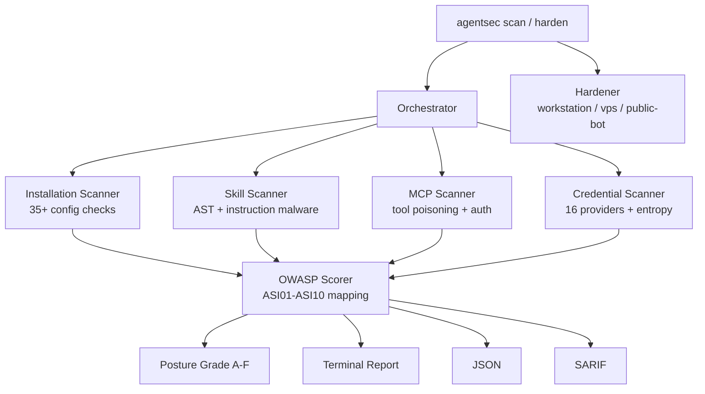

# agentsec

[](LICENSE)
[](https://www.python.org/)
[](#)
[](https://pypi.org/project/agentsec-ai/)
[](https://pypi.org/project/agentsec-ai/)
[](https://genai.owasp.org/)

**Immunize your OpenClaw installation.** One command. Full security posture. Actionable hardening.

agentsec is a security scanner and hardener for agentic AI installations. It scans [OpenClaw](https://github.com/openclaw/openclaw) (formerly Clawdbot/Moltbot), MCP servers, and AI agent skill ecosystems for security vulnerabilities, mapping every finding to the [OWASP Top 10 for Agentic Applications (2026)](https://genai.owasp.org/).

## Why agentsec?

- **135,000+** OpenClaw instances exposed to the internet ([Bitdefender](https://www.bitdefender.com/en-us/blog/hotforsecurity/135k-openclaw-ai-agents-exposed-online))
- **36.82%** of ClawHub skills contain vulnerabilities ([Snyk ToxicSkills](https://snyk.io/blog/toxicskills-malicious-ai-agent-skills-clawhub/))
- **5 active CVEs** affecting OpenClaw installations pre-v2026.2.12
- **32%** of MCP servers have critical vulnerabilities ([Enkrypt AI](https://www.enkryptai.com/blog/we-scanned-1-000-mcp-servers-33-had-critical-vulnerabilities))

agentsec catches these issues before attackers do.

## Quick Start

```bash
pip install agentsec-ai
agentsec scan
```

That's it. Run `agentsec scan` in any directory containing an agent installation and get an instant security report with OWASP risk scoring.

## What It Scans

| Module | What it checks |
|--------|---------------|
| **Installation** | Gateway bind mode, DM/group policy, tool profiles, exec approvals, sandbox posture, SSRF protection, safety scanner config, mDNS discovery, auth config, plaintext secrets, file/directory permissions, 5 known CVEs, SOUL.md/AGENTS.md/TOOLS.md integrity |
| **Skills** | Instruction malware (pipe-to-shell, credential targeting, remote scripts), dangerous code patterns (eval/exec/subprocess), prompt injection in tool descriptions and markdown, frontmatter capability analysis, supply chain risks |
| **MCP Servers** | Tool poisoning, hardcoded credentials, missing auth, cross-origin risks, excessive permissions, unverified packages |
| **Credentials** | Deep recursive secret scan with 16 provider-specific patterns, high-entropy string detection, git credential exposure |

Every finding is mapped to the **OWASP Agentic Top 10 (2026)** with severity ratings and actionable remediation steps.

## Check Catalog

agentsec implements 35+ security checks across 10 categories:

| ID | Check | Severity |
|----|-------|----------|
| **CGW-001** | Gateway bound to non-loopback | Critical |
| **CGW-002** | Gateway auth missing on exposed interface | Critical |
| **CGW-003** | Control UI insecure auth / dangerouslyDisable flags | Critical |
| **CGW-004** | Reverse proxy without trustedProxies | Medium |
| **CGW-005** | No SSRF protection for URL-based inputs | High |
| **CID-001** | DM policy set to open | Critical |
| **CID-002** | Group policy open / wildcard allowlist | High |
| **CID-003** | DM scope not per-channel-peer | Medium |
| **CTO-001** | Full tool profile with open inbound | Critical |
| **CTO-002** | group:runtime enabled for untrusted routes | High |
| **CTO-003** | Sandbox disabled with full tools + open input | High |
| **CEX-001** | Exec approvals file missing | High |
| **CEX-002** | Exec approvals defaults too permissive | High |
| **CEX-003** | safeBins expanded beyond defaults | Medium |
| **CSK-001** | Remote pipe-to-shell in skill instructions | Critical |
| **CSK-002** | Obfuscation/decoder patterns | Medium |
| **CSK-003** | Credential path targeting | High |
| **CSK-004** | Setup scripts requesting external execution | High |
| **CSK-005** | disable-model-invocation absent on capable skills | Medium |
| **CPL-001** | Plugins installed without explicit allowlist | Medium |
| **CFS-001** | Agent config directory not 700 | High |
| **CFS-002** | Sensitive files (auth-profiles, sessions) world-readable | High |
| **CSF-001** | Built-in safety scanner disabled (v2026.2.6+) | High |
| **CSF-002** | Credential redaction disabled (v2026.2.6+) | Medium |
| **CMCP-001** | MCP server with high-privilege tools | Critical |
| **CMCP-002** | Remote MCP endpoint without auth | High |
| **CMCP-003** | Unpinned MCP dependencies / unverified npx | Medium |

### Known CVE Detection

| CVE | Description | Fixed In |
|-----|-------------|----------|
| CVE-2026-25253 | One-click RCE via WebSocket hijacking | 2026.1.29 |
| CVE-2026-24763 | Command injection in Docker sandbox via PATH | 2026.1.29 |
| CVE-2026-25157 | SSH command injection via sshNodeCommand | 2026.1.29 |
| CVE-2026-25593 | Unauthenticated local RCE via WebSocket API | 2026.1.30 |
| CVE-2026-25475 | Path traversal via MEDIA: file extraction | 2026.1.30 |

## How It Compares

| Capability | agentsec | Snyk agent-scan | Cisco Skill Scanner | Agentic Radar |
|-----------|----------|----------------|-------------------|---------------|
| Installation config scanning (35+ checks) | Yes | No | No | No |
| Skill malware analysis (AST + patterns) | Yes | Yes | Yes (LLM-based) | No |
| MCP server scanning | Yes | Yes | Yes | Yes |
| Credential scanning (16 providers) | Yes | Partial | No | No |
| OWASP ASI01-ASI10 mapping (all 10) | Yes | No | No | Partial |
| Security posture grade (A-F) | Yes | No | No | No |
| Auto-hardening profiles | Yes (3) | No | No | No |
| SARIF output for GitHub | Yes | No | Yes | No |
| Fully offline / no cloud dependency | Yes | Partial | No | Partial |
| Pre-commit hook | Yes | No | No | No |
| CVE detection (5 known) | Yes | No | No | No |

## Usage

```bash
# Scan current directory (auto-detects agent type)
agentsec scan

# Scan a specific path
agentsec scan ~/.openclaw

# JSON output for CI pipelines
agentsec scan -o json -f report.json

# SARIF output for GitHub Code Scanning
agentsec scan -o sarif -f results.sarif

# Only run specific scanners
agentsec scan -s installation,credential

# Fail on critical findings only (for CI)
agentsec scan --fail-on critical

# Quiet mode (exit code only, no output)
agentsec scan --quiet --fail-on high

# List available scanners
agentsec list-scanners
```

## Hardening

agentsec can apply profile-based hardening to your OpenClaw installation:

```bash
# Preview what would change (dry run)
agentsec harden -p workstation --dry-run

# Apply workstation hardening
agentsec harden -p workstation --apply

# VPS hardening (remote hosting)
agentsec harden -p vps --apply

# Public bot hardening (strictest -- sandbox, minimal tools, no exec)
agentsec harden -p public-bot --apply
```

### Hardening Profiles

| Profile | Use Case | Key Settings |
|---------|----------|-------------|
| `workstation` | Single owner, local use | Loopback bind, paired DMs, messaging tools, minimal mDNS |
| `vps` | Remote/cloud hosting | Loopback + proxy, strong auth, mDNS off, tool restrictions |
| `public-bot` | Untrusted input | Sandbox all, minimal tools, deny exec/browser/web, strict auth |

## Programmatic Usage

```python
from pathlib import Path
from agentsec import run_scan, AgentsecConfig, ScanTarget

config = AgentsecConfig(
    targets=[ScanTarget(path=Path.home() / ".openclaw")],
)
report = run_scan(config)

for finding in report.findings:
    print(f"{finding.severity.value}: {finding.title}")
```

## Security Grade

agentsec produces a security posture grade (A-F) based on aggregate findings:

```
Summary
  Total findings    7
  Critical          2
  High              3
  Medium            1
  Low               1
  Security grade    D (42.5/100)
  Result            FAIL
```

## OWASP Agentic Top 10 Coverage

agentsec maps every finding to the OWASP Top 10 for Agentic Applications:

| ID | Category | What agentsec checks |
|----|----------|---------------------|
| ASI01 | Agent Goal Hijack | Prompt injection in skills, tool descriptions, SOUL.md, instruction malware |
| ASI02 | Excessive Agency | Full tool profiles, group:runtime, auto-approve, open DMs, missing sandbox, SSRF |
| ASI03 | Supply Chain | Malicious skills, unpinned deps, unverified MCP servers, npm install hooks, disabled safety scanner |
| ASI04 | Knowledge Poisoning | SOUL.md/AGENTS.md/TOOLS.md tampering, config drift |
| ASI05 | Privilege Compromise | Plaintext secrets, missing auth, gateway exposure, mDNS broadcast, disabled credential redaction |
| ASI06 | Memory Manipulation | Conversation history tampering patterns |
| ASI07 | Multi-Agent Exploitation | Cross-agent trust, shared DM scope |
| ASI08 | Uncontrolled Cascading | Missing exec approvals, permissive askFallback, expanded safeBins |
| ASI09 | Repudiation | Insufficient audit trail, mDNS full mode |
| ASI10 | Misaligned Behaviors | Insecure defaults, disabled auth, dangerous flags |

## Architecture



## CI/CD Integration

### GitHub Actions

```yaml
name: Security Scan
on: [push, pull_request]

jobs:
  agentsec:
    runs-on: ubuntu-latest
    permissions:
      contents: read
      security-events: write
    steps:
      - uses: actions/checkout@v4
      - uses: actions/setup-python@v5
        with:
          python-version: '3.12'
      - run: pip install agentsec-ai

      - name: Run security scan
        run: agentsec scan -o sarif -f results.sarif --fail-on high

      - name: Upload to GitHub Code Scanning
        if: always()
        uses: github/codeql-action/upload-sarif@v3
        with:
          sarif_file: results.sarif
```

### Pre-commit Hook

```yaml
# .pre-commit-config.yaml
repos:
  - repo: https://github.com/debu-sinha/agentsec
    rev: v0.3.0
    hooks:
      - id: agentsec-scan
        args: ['--fail-on', 'critical']
```

## Output Formats

| Format | Flag | Use case |
|--------|------|----------|
| Terminal | `-o terminal` (default) | Interactive use, color-coded with Rich |
| JSON | `-o json` | CI pipelines, programmatic consumption |
| SARIF | `-o sarif` | GitHub Code Scanning, VS Code, IDE integration |

## Development

```bash
git clone https://github.com/debu-sinha/agentsec.git
cd agentsec
pip install -e ".[dev]"
pytest
```

## License

Apache-2.0
