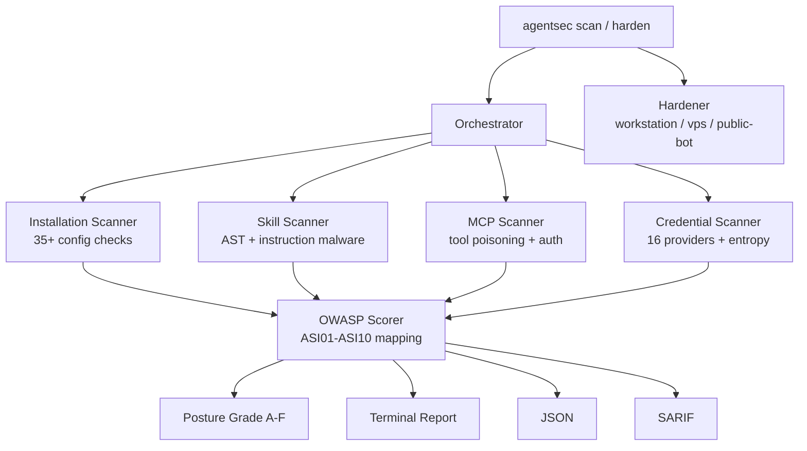

# agentsec

[](LICENSE)
[](https://www.python.org/)
[](https://github.com/debu-sinha/agentsec/actions)
[](https://pypi.org/project/agentsec-ai/)
[](https://pypi.org/project/agentsec-ai/)
[](https://genai.owasp.org/)

**Immunize your OpenClaw installation.** One command to assess posture, plus actionable hardening.

agentsec is a security posture scanner and hardener for agentic AI installations. It currently supports [OpenClaw](https://github.com/openclaw/openclaw) (formerly Clawdbot/Moltbot) and Claude Code, scanning installation configs, MCP servers, skill ecosystems, and credentials for security vulnerabilities. Every finding maps to the [OWASP Top 10 for Agentic Applications (2026)](https://genai.owasp.org/).

## Why agentsec?

- **135,000+** OpenClaw instances exposed to the internet ([Bitdefender](https://www.bitdefender.com/en-us/blog/hotforsecurity/135k-openclaw-ai-agents-exposed-online))
- **36.82%** of ClawHub skills contain vulnerabilities ([Snyk ToxicSkills](https://snyk.io/blog/toxicskills-malicious-ai-agent-skills-clawhub/))
- **5 known CVEs** detected for pre-patch OpenClaw versions (see CVE table below)
- **32%** of MCP servers have critical vulnerabilities ([Enkrypt AI](https://www.enkryptai.com/blog/we-scanned-1-000-mcp-servers-33-had-critical-vulnerabilities))

agentsec helps surface these issues early so they can be remediated before deployment.

## Quick Start

```bash
pip install agentsec-ai
agentsec scan
```

That's it. Run `agentsec scan` in any directory containing an agent installation and get an instant security report with OWASP risk scoring.

## What It Scans

| Module | What it checks |
|--------|---------------|
| **Installation** | Gateway bind mode, DM/group policy, tool profiles, exec approvals, sandbox posture, SSRF protection, safety scanner config, mDNS discovery, auth config, plaintext secrets, file/directory permissions, 5 known CVEs, SOUL.md/AGENTS.md/TOOLS.md integrity |
| **Skills** | Instruction malware (pipe-to-shell, credential targeting, remote scripts), dangerous code patterns (eval/exec/subprocess), prompt injection in tool descriptions and markdown, frontmatter capability analysis, supply chain risks |
| **MCP Servers** | Tool poisoning, hardcoded credentials, missing auth, cross-origin risks, excessive permissions, unverified packages |
| **Credentials** | Deep recursive secret scan with 16 provider-specific patterns, high-entropy string detection, git credential exposure |

Every finding is mapped to the **OWASP Agentic Top 10 (2026)** with severity ratings and actionable remediation steps.

## Check Catalog

agentsec implements 35+ security checks across 10 categories:

| ID | Check | Severity |
|----|-------|----------|
| **CGW-001** | Gateway bound to non-loopback | Critical |
| **CGW-002** | Gateway auth missing on exposed interface | Critical |
| **CGW-003** | Control UI insecure auth / dangerouslyDisable flags | Critical |
| **CGW-004** | Reverse proxy without trustedProxies | Medium |
| **CGW-005** | No SSRF protection for URL-based inputs | High |
| **CID-001** | DM policy set to open | Critical |
| **CID-002** | Group policy open / wildcard allowlist | High |
| **CID-003** | DM scope not per-channel-peer | Medium |
| **CTO-001** | Full tool profile with open inbound | Critical |
| **CTO-002** | group:runtime enabled for untrusted routes | High |
| **CTO-003** | Sandbox disabled with full tools + open input | High |
| **CEX-001** | Exec approvals file missing | High |
| **CEX-002** | Exec approvals defaults too permissive | High |
| **CEX-003** | safeBins expanded beyond defaults | Medium |
| **CSK-001** | Remote pipe-to-shell in skill instructions | Critical |
| **CSK-002** | Obfuscation/decoder patterns | Medium |
| **CSK-003** | Credential path targeting | High |
| **CSK-004** | Setup scripts requesting external execution | High |
| **CSK-005** | disable-model-invocation absent on capable skills | Medium |
| **CPL-001** | Plugins installed without explicit allowlist | Medium |
| **CFS-001** | Agent config directory not 700 | High |
| **CFS-002** | Sensitive files (auth-profiles, sessions) world-readable | High |
| **CSF-001** | Built-in safety scanner disabled (v2026.2.6+) | High |
| **CSF-002** | Credential redaction disabled (v2026.2.6+) | Medium |
| **CMCP-001** | MCP server with high-privilege tools | Critical |
| **CMCP-002** | Remote MCP endpoint without auth | High |
| **CMCP-003** | Unpinned MCP dependencies / unverified npx | Medium |

### Known CVE Detection

| CVE | Description | Fixed In |
|-----|-------------|----------|
| CVE-2026-25253 | One-click RCE via WebSocket hijacking | 2026.1.29 |
| CVE-2026-24763 | Command injection in Docker sandbox via PATH | 2026.1.29 |
| CVE-2026-25157 | SSH command injection via sshNodeCommand | 2026.1.29 |
| CVE-2026-25593 | Unauthenticated local RCE via WebSocket API | 2026.1.30 |
| CVE-2026-25475 | Path traversal via MEDIA: file extraction | 2026.1.30 |

## How It Compares

*Based on public documentation as of February 2026. Capabilities may have changed.*

| Capability | agentsec | Snyk agent-scan | Cisco Skill Scanner | Agentic Radar |
|-----------|----------|----------------|-------------------|---------------|
| Installation config scanning (35+ checks) | Yes | No | No | No |
| Skill malware analysis (AST + patterns) | Yes | Yes | Yes (LLM-based) | No |
| MCP server scanning | Yes | Yes | Yes | Yes |
| Credential scanning (16 providers) | Yes | Partial | No | No |
| OWASP ASI01-ASI10 mapping (all 10) | Yes | No | No | Partial |
| Security posture grade (A-F) | Yes | No | No | No |
| Auto-hardening profiles | Yes (3) | No | No | No |
| SARIF output for GitHub | Yes | No | Yes | No |
| Fully offline / no cloud dependency | Yes | Partial | No | Partial |
| Pre-commit hook | Yes | No | No | No |
| Pre-install security gate | Yes | No | No | No |
| CVE detection (5 known) | Yes | No | No | No |

## Usage

```bash
# Scan current directory (auto-detects agent type)
agentsec scan

# Scan a specific path
agentsec scan ~/.openclaw

# JSON output for CI pipelines
agentsec scan -o json -f report.json

# SARIF output for GitHub Code Scanning
agentsec scan -o sarif -f results.sarif

# Only run specific scanners
agentsec scan -s installation,credential

# Fail on critical findings only (for CI)
agentsec scan --fail-on critical

# Verbose mode (detailed findings + OWASP posture table)
agentsec scan --verbose

# Quiet mode (exit code only, no output)
agentsec scan --quiet --fail-on high

# List available scanners
agentsec list-scanners
```

## Automation Commands

```bash
# Watch for changes and auto-scan (polling)
agentsec watch ~/.openclaw -i 2

# Show all settings a hardening profile would change
agentsec show-profile workstation

# Generate shell hook wrappers for npm/pip installs
agentsec hook --shell zsh
```

## Hardening

agentsec can apply profile-based hardening to your OpenClaw installation:

```bash
# Preview what would change (dry run)
agentsec harden -p workstation --dry-run

# Apply workstation hardening
agentsec harden -p workstation --apply

# VPS hardening (remote hosting)
agentsec harden -p vps --apply

# Public bot hardening (strictest -- sandbox, minimal tools, no exec)
agentsec harden -p public-bot --apply
```

### Hardening Profiles

| Profile | Use Case | Key Settings |
|---------|----------|-------------|
| `workstation` | Single owner, local use | Loopback bind, paired DMs, messaging tools, minimal mDNS |
| `vps` | Remote/cloud hosting | Loopback + proxy, strong auth, mDNS off, tool restrictions |
| `public-bot` | Untrusted input | Sandbox all, minimal tools, deny exec/browser/web, strict auth |

## Pre-Install Security Gate

Scan packages BEFORE installation. agentsec downloads the package to a temp directory, runs security checks, and blocks the install if critical issues are found.

```bash
# Gate an npm install (scans before installing)
agentsec gate npm install some-skill

# Gate a pip install
agentsec gate pip install some-mcp-server

# Block on high severity or above
agentsec gate --fail-on high npm install untrusted-pkg

# Dry run -- scan only, don't install
agentsec gate --dry-run npm install suspicious-pkg

# Force install despite findings
agentsec gate --force npm install risky-but-needed
```

What gets checked pre-install:
- Known-malicious package blocklist
- npm install hooks (preinstall/postinstall scripts)
- Dangerous code patterns (eval, exec, subprocess, reverse shells)
- Obfuscation and data exfiltration patterns
- Prompt injection in tool descriptions
- MCP tool poisoning signatures

If the package is clean, the real install proceeds automatically. If issues are found above your threshold, installation is blocked with a detailed report.

## Programmatic Usage

```python
from pathlib import Path
from agentsec import run_scan, AgentsecConfig, ScanTarget

config = AgentsecConfig(
    targets=[ScanTarget(path=Path.home() / ".openclaw")],
)
report = run_scan(config)

for finding in report.findings:
    print(f"{finding.severity.value}: {finding.title}")
```

## Security Grade

agentsec produces a screenshot-worthy security posture report with an A-F grade:

```
agentsec v0.4.0 — AI Agent Security Scanner
Target: ~/.openclaw · Agent: claude-code

Security Grade:  D
━━━━━━━━━━━━━━━━━━━━━━━━━━━━━━━━━━━━━━━━━━━━━━━━━━ 42/100
5 critical · 1 high · 1 medium · 0 low
FAIL

█████████████████████████████████████████████████
█ CRIT:5  █ HIGH:1  █ MED:1

 Sev  Finding                                    OWASP
 CRIT Gateway bound to 0.0.0.0 (openclaw.json)   ASI05
 CRIT Plaintext API key found (auth-profiles)     ASI05
 ...

╭──────────── Fix First ────────────╮
│ 1. [CRIT] Gateway exposed → agentsec harden -p workstation --apply │
│ 2. [CRIT] Plaintext API key → Move to OS keychain / env var        │
╰───────────────────────────────────╯

8 findings · 4 scanners · 0.08s · 50 files
```

Use `--verbose` for detailed findings with evidence, remediation steps, and OWASP posture breakdown.

## OWASP Agentic Top 10 Coverage

agentsec maps every finding to the OWASP Top 10 for Agentic Applications:

| ID | Category | What agentsec checks |
|----|----------|---------------------|
| ASI01 | Agent Goal Hijack | Prompt injection in skills, tool descriptions, SOUL.md, instruction malware |
| ASI02 | Excessive Agency | Full tool profiles, group:runtime, auto-approve, open DMs, missing sandbox, SSRF |
| ASI03 | Supply Chain | Malicious skills, unpinned deps, unverified MCP servers, npm install hooks, disabled safety scanner |
| ASI04 | Knowledge Poisoning | SOUL.md/AGENTS.md/TOOLS.md tampering, config drift |
| ASI05 | Privilege Compromise | Plaintext secrets, missing auth, gateway exposure, mDNS broadcast, disabled credential redaction |
| ASI06 | Memory Manipulation | Conversation history tampering patterns |
| ASI07 | Multi-Agent Exploitation | Cross-agent trust, shared DM scope |
| ASI08 | Uncontrolled Cascading | Missing exec approvals, permissive askFallback, expanded safeBins |
| ASI09 | Repudiation | Insufficient audit trail, mDNS full mode |
| ASI10 | Misaligned Behaviors | Insecure defaults, disabled auth, dangerous flags |

## Architecture



## CI/CD Integration

### GitHub Action

The fastest way to add agentsec to your CI pipeline:

```yaml
- uses: debu-sinha/agentsec@v0.4.0
  with:
    fail-on: high
```

This installs agentsec, runs a full scan, and uploads SARIF results to GitHub Code Scanning automatically.

**Full example with all options:**

```yaml
name: Security Scan
on: [push, pull_request]

jobs:
  agentsec:
    runs-on: ubuntu-latest
    permissions:
      contents: read
      security-events: write
    steps:
      - uses: actions/checkout@v4
      - uses: debu-sinha/agentsec@v0.4.0
        with:
          target: '.'
          fail-on: high
          output: sarif
          scanners: 'installation,skill,mcp,credential'
          upload-sarif: 'true'
```

| Input | Default | Description |
|-------|---------|-------------|
| `target` | `.` | Path to scan |
| `fail-on` | `high` | Minimum severity to fail the build (critical, high, medium, low, info, none) |
| `output` | `sarif` | Output format (terminal, json, sarif) |
| `output-file` | `results.sarif` | File path for scan results |
| `scanners` | all | Comma-separated list (installation, skill, mcp, credential) |
| `python-version` | `3.12` | Python version to use |
| `upload-sarif` | `true` | Upload SARIF results to GitHub Code Scanning |

### Pre-commit Hook

```yaml
# .pre-commit-config.yaml
repos:
  - repo: https://github.com/debu-sinha/agentsec
    rev: v0.4.0
    hooks:
      - id: agentsec-scan
        args: ['--fail-on', 'critical']
```

## Output Formats

| Format | Flag | Use case |
|--------|------|----------|
| Terminal | `-o terminal` (default) | Interactive use, color-coded with Rich |
| JSON | `-o json` | CI pipelines, programmatic consumption |
| SARIF | `-o sarif` | GitHub Code Scanning, VS Code, IDE integration |

## Output Examples

### JSON Output

```bash
agentsec scan -o json -f report.json
```

```json
{
  "scan_id": "a1b2c3d4",
  "target_path": "/home/user/.openclaw",
  "agent_type": "openclaw",
  "findings": [
    {
      "id": "f-abc123",
      "scanner": "installation",
      "category": "NETWORK_EXPOSURE",
      "severity": "CRITICAL",
      "title": "Gateway bound to non-loopback address",
      "description": "openclaw.json gateway.bind is set to 'lan'",
      "owasp_ids": ["ASI05"],
      "remediation": {
        "summary": "Bind gateway to loopback",
        "steps": ["Set gateway.bind to 'loopback' in openclaw.json"],
        "automated": true,
        "command": "agentsec harden -p workstation --apply"
      }
    }
  ],
  "summary": {
    "total_findings": 5,
    "critical": 2,
    "high": 1,
    "medium": 2
  }
}
```

### SARIF Output

```bash
agentsec scan -o sarif -f results.sarif
```

SARIF output integrates with GitHub Code Scanning, VS Code, and other IDE tools. Findings appear as inline annotations on your code:

```json
{
  "$schema": "https://json.schemastore.org/sarif-2.1.0.json",
  "version": "2.1.0",
  "runs": [{
    "tool": {
      "driver": {
        "name": "agentsec",
        "semanticVersion": "0.4.0",
        "rules": [{
          "id": "CGW-001",
          "name": "GatewayNonLoopback",
          "shortDescription": {"text": "Gateway bound to non-loopback address"},
          "properties": {"security-severity": "9.5"}
        }]
      }
    },
    "results": [{
      "ruleId": "CGW-001",
      "level": "error",
      "message": {"text": "Gateway bound to non-loopback address"},
      "locations": [{
        "physicalLocation": {
          "artifactLocation": {"uri": "openclaw.json"}
        }
      }]
    }]
  }]
}
```

## Troubleshooting

### "0 findings" on a known-vulnerable installation

agentsec needs to find agent config files to scan. Make sure you're running from the right directory:

```bash
# Run from the directory containing openclaw.json
cd ~/.openclaw && agentsec scan

# Or pass the path explicitly
agentsec scan ~/.openclaw
```

If detection looks wrong, run with verbose output and pass the path explicitly:
```bash
agentsec scan ~/.openclaw --verbose
```

### Permission errors on Linux/macOS

The credential scanner needs read access to config files. If you see permission errors:
```bash
# Run with the user that owns the installation
agentsec scan ~/.openclaw

# Or check file permissions
ls -la ~/.openclaw/
```

### Docker scan issues

When running agentsec inside Docker, mount the agent directory:
```bash
docker run -v ~/.openclaw:/scan agentsec-ai scan /scan
```

### Gate command can't find npm/pip

The `agentsec gate` command needs npm or pip on your PATH:
```bash
# Verify npm is available
which npm

# Verify pip is available
which pip
```

### SARIF upload fails in GitHub Actions

Make sure your workflow has the right permissions:
```yaml
permissions:
  contents: read
  security-events: write  # Required for SARIF upload
```

### High-entropy false positives in credential scanner

The credential scanner uses Shannon entropy to detect unknown secret formats. If you get false positives on base64-encoded non-secrets:
```bash
# Run without the credential scanner
agentsec scan -s installation,skill,mcp
```

## Benchmarks and Case Studies

- [Benchmark results (v0.4.0)](docs/benchmarks/results/2026-02-15-v0.4.0.md) - precision/recall/F1 on 20-fixture test matrix
- [Case study: insecure workstation remediation](docs/case-studies/001-insecure-openclaw-workstation.md) - before/after scan with hardening

## Development

```bash
git clone https://github.com/debu-sinha/agentsec.git
cd agentsec
pip install -e ".[dev]"
pytest
```

## License

Apache-2.0
