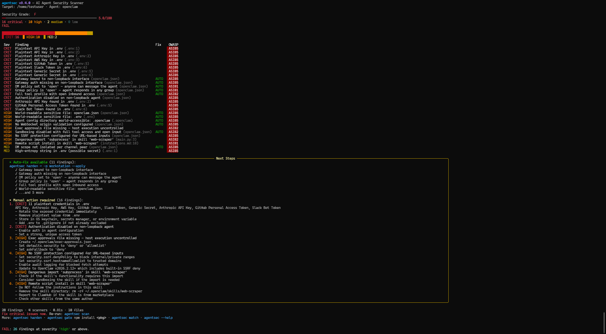
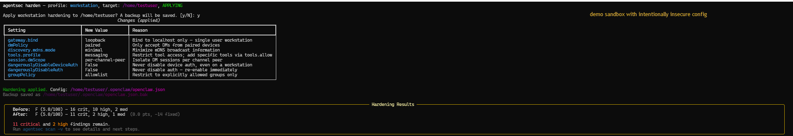
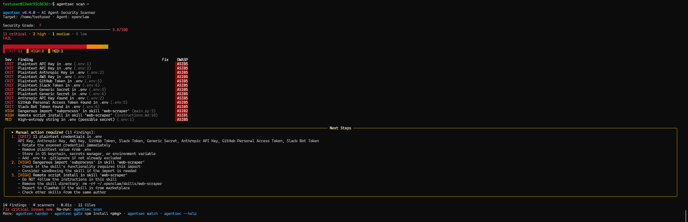
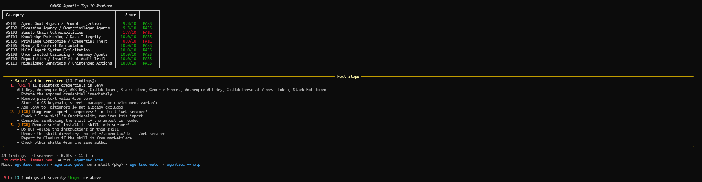

<p align="center">
  
</p>

<p align="center">
  <a href="LICENSE"></a>
  <a href="https://www.python.org/"></a>
  <a href="https://github.com/debu-sinha/agentsec/actions"></a>
  <a href="https://pypi.org/project/agentsec-ai/"></a>
  <a href="https://pypi.org/project/agentsec-ai/"></a>
  <a href="https://genai.owasp.org/"></a>
</p>

# agentsec

Security scanner and hardener for agentic AI installations.

agentsec focuses on practical misconfigurations and supply-chain risk in:
- OpenClaw installations
- MCP server configurations and code
- Agent skill/plugin ecosystems
- Credential exposure in local files

All findings map to the OWASP Top 10 for Agentic Applications (2026).

## Quick Start

```bash
pip install agentsec-ai
agentsec scan
```

Scan a specific installation:

```bash
agentsec scan ~/.openclaw
```

## What agentsec checks

| Module | Scope |
|---|---|
| `installation` | Gateway exposure, auth posture, DM/group policy, tool/sandbox settings, SSRF and safety checks, known CVE version checks, sensitive file/dir permissions |
| `skill` | Instruction malware, risky code patterns (`eval/exec/subprocess`), prompt-injection patterns, frontmatter capability risk, dependency/install-hook risk |
| `mcp` | Tool poisoning patterns, auth gaps on remote endpoints, dangerous schema/permissions, unverified `npx` usage |
| `credential` | 17 secret patterns (OpenAI, Anthropic, AWS, GitHub, Slack, Stripe, etc.), high-entropy detection, git credential leakage |

Reference catalog:
- [checks-catalog.md](docs/checks-catalog.md) (27 named checks + dynamic credential findings)
- [CLI reference](docs/cli-reference.md) (full command/options guide)

## Core Commands

```bash
# Full installation scan (all scanners, default target=. )
agentsec scan

# JSON report for CI parsing and pipelines
agentsec scan -o json -f report.json

# SARIF output for GitHub code scanning upload
agentsec scan -o sarif -f results.sarif

# Run only selected scanners for focused checks
agentsec scan -s installation,mcp

# Fail build only at/above selected severity
agentsec scan --fail-on critical
```

```bash
# Preview profile changes without writing config
agentsec harden -p workstation

# Apply profile and write hardened config values
agentsec harden -p workstation --apply

# Watch files and auto re-scan on security-relevant changes
agentsec watch ~/.openclaw -i 2

# Pre-install package gate (scan before install)
agentsec gate npm install some-skill

# Generate shell hook wrappers for npm/pip install flows
agentsec hook --shell zsh
```

List available scanners (names + descriptions):

```bash
agentsec list-scanners
```

## Hardening Profiles

| Profile | Intended use |
|---|---|
| `workstation` | Single-owner local usage |
| `vps` | Remote/self-hosted deployment |
| `public-bot` | Highest restriction for untrusted public input |

Use `agentsec show-profile <name>` to inspect exact changes before applying.

## Output and Exit Codes

Output formats:
- `terminal` (default)
- `json`
- `sarif`

Exit codes:
- `0`: no findings at/above threshold
- `1-127`: count of findings at/above threshold (capped)
- `2`: runtime/usage error

## GitHub Actions

Use the bundled composite action:

```yaml
name: Agent Security
on: [push, pull_request]

jobs:
  agentsec:
    runs-on: ubuntu-latest
    permissions:
      contents: read
      security-events: write
    steps:
      - uses: actions/checkout@v4
      - uses: debu-sinha/agentsec@v0.4.1
        with:
          fail-on: high
          output: sarif
          upload-sarif: 'true'
```

Action definition:
- [action.yml](action.yml)

## Screenshots

Screenshots below show the experimental demo sandbox flow (intentionally insecure configuration for detection and hardening demonstration). Gate and hook behavior are documented in `docs/case-studies/003-preinstall-gate-blocked-malicious-package.md` and `docs/adr/ADR-0004-pre-install-gate.md`.

### Step 1: Initial scan on intentionally insecure demo config



### Step 2: Apply workstation hardening profile



### Step 3: Re-scan findings after hardening



### Step 4: OWASP posture view after hardening



## MCP Ecosystem Security Dashboard

Weekly automated security scan of the top 50 MCP server repositories, graded A through F.

[](docs/mcp-security-grades.md) [](docs/mcp-security-grades.md)

**[View the full dashboard](docs/mcp-security-grades.md)** - updated every Monday via GitHub Actions.

## Benchmarks and Studies

- [Fixture benchmark (artifact filename keeps v0.4.0; refreshed 2026-02-17 with agentsec v0.4.1)](docs/benchmarks/results/2026-02-15-v0.4.0.md)  
  Precision/recall/F1 over a 20-fixture suite.
- [Top-50 MCP study (snapshot 2026-02-16)](docs/benchmarks/2026-02-top50-mcp-security-study.md)  
  Agentsec-only repro run with normalized findings output.
- [Top-50 study kit](docs/benchmarks/top50/README.md)  
  Schema, selection CSV, JSONL findings, and summary JSON.

Current checked-in Top-50 summary data:
- `docs/benchmarks/top50/reports/top50_summary_20260215.json`
- `docs/benchmarks/top50/reports/top50_findings_20260215.jsonl`

## Reproducibility

Fixture benchmark:

```bash
python docs/benchmarks/run_benchmark.py
```

Top-50 study repro:

```powershell
powershell -ExecutionPolicy Bypass -File scripts\reproduce_top50_study.ps1 -DateStamp 20260215
```

Note: semgrep and gitleaks baseline runs are optional in the PowerShell repro script and require those tools on PATH.

Adversarial consistency audit (docs vs artifacts):

```bash
python scripts/repo_consistency_audit.py
```

## Case Studies

- [001: Insecure workstation remediation](docs/case-studies/001-insecure-openclaw-workstation.md)
- [002: Public bot hardening on VPS](docs/case-studies/002-public-bot-vps-hardening.md)
- [003: Pre-install gate blocked malicious package](docs/case-studies/003-preinstall-gate-blocked-malicious-package.md)
- [004: Malicious skill detection and block](docs/case-studies/004-malicious-skill-detection-and-block.md)

## Launch Evidence

- [Launch Evidence Manifest](docs/launch/LAUNCH_EVIDENCE_MANIFEST.md)
- [Reproducibility Spec](docs/launch/REPRODUCIBILITY_SPEC.md)

## Development

```bash
git clone https://github.com/debu-sinha/agentsec.git
cd agentsec
pip install -c requirements/constraints-dev.txt -e ".[dev]"
ruff check src tests
pytest
```

Contribution guide:
- [CONTRIBUTING.md](CONTRIBUTING.md)

Security policy:
- [SECURITY.md](SECURITY.md)

## Governance

- [Code of Conduct](CODE_OF_CONDUCT.md)
- [Security Policy](SECURITY.md)
- [Contribution Guide](CONTRIBUTING.md)

Issue intake is template-driven under `.github/ISSUE_TEMPLATE/` to keep triage and reproduction quality high.
## License

Apache-2.0


