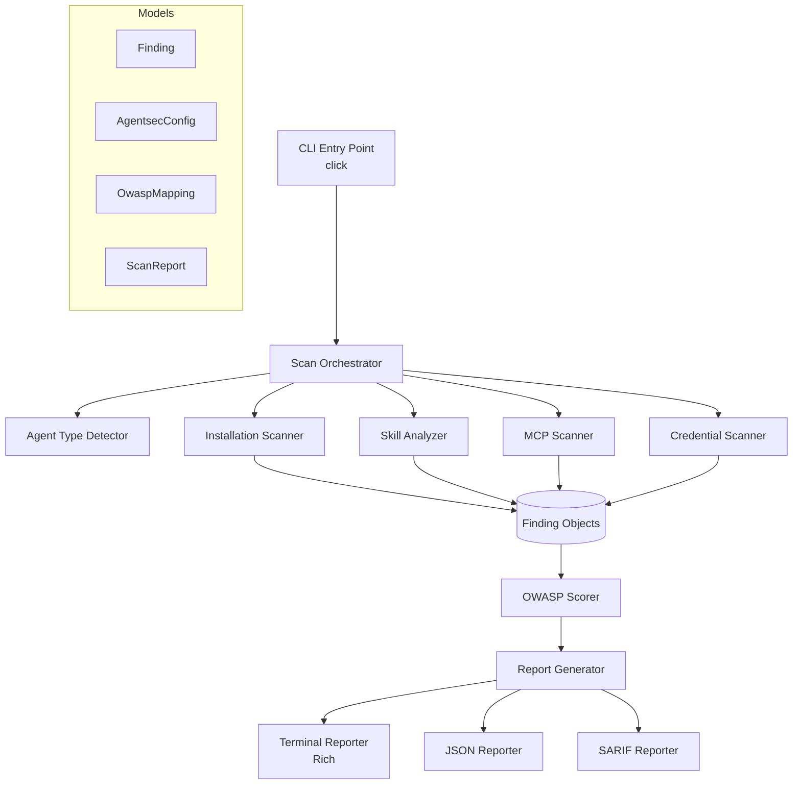
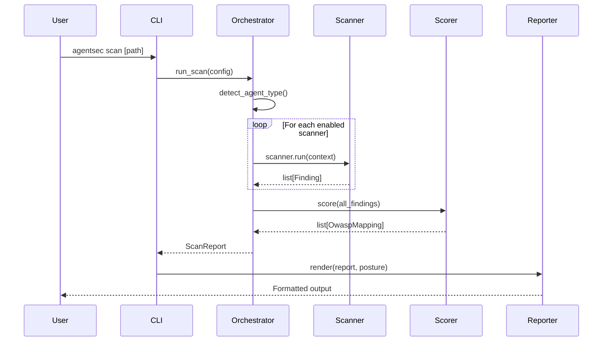

# agentsec -- Architecture Design Document

## Goals

Build a comprehensive, developer-friendly security scanner and hardener for agentic AI installations that:

1. Detects high-impact OpenClaw security misconfigurations, secret exposure, and known CVE patterns
2. Maps all findings to the OWASP Top 10 for Agentic Applications (2026)
3. Provides actionable remediation guidance with auto-fix capabilities
4. Runs as a single CLI command (`agentsec scan`) with zero configuration
5. Integrates into CI/CD pipelines via JSON output and configurable exit codes
6. Produces reproducible evidence artifacts for security review and release gating

## Non-Goals

- Runtime agent monitoring or real-time policy enforcement (v2)
- Commercial SaaS platform (future)
- Competing with enterprise platforms like Akto or Cisco AI Defense
- Replacing OpenClaw's built-in `openclaw security audit` command
- Supporting non-agent AI systems (pure chatbots, model serving without agency)

## Background / Context

### The Problem

OpenClaw deployments commonly combine inbound exposure, permissive messaging policies, over-broad tool access, and plaintext credentials. This project targets that installation-level risk with deterministic checks, hardening profiles, and reproducible artifacts.

### Why This Tool Exists

This repository focuses on one operational workflow: local scanning + hardening + report export. Comparative market analysis is intentionally out of scope for this design document unless benchmarked in-repo.

### Why Now

- OWASP Agentic Top 10 provides a practical taxonomy for mapping findings.
- OpenClaw deployments are expanding, and installation-hardening workflows are often ad hoc.
- Reproducible local evidence is needed for launch and compliance reviews.

## Requirements

### Scale / Performance
- Scan a typical OpenClaw installation (<1,000 files) in under 5 seconds
- Handle installations up to 50K files without OOM
- JSON report generation in constant time

### Usability
- Zero-config: `agentsec scan` works with auto-detection
- Single pip install, no system dependencies required
- Clear, actionable output for non-security-experts
- CI/CD-friendly with configurable exit codes

### Security (of the tool itself)
- Never log, display, or store full secrets -- always sanitize
- No network calls during scanning (fully offline)
- No code execution from scanned targets
- Read-only operations only (no modifications without explicit `--apply`)

### Extensibility
- Plugin architecture for custom scanner modules
- Configurable via CLI flags and config file
- YARA rule support for custom detection patterns (optional dependency)

## Current State

v0.4.0 shipped with 206 tests, 4 scanner modules, pre-install gate, 3 hardening profiles, and SARIF output.

## Design

### Architecture

### Module Responsibilities

**Orchestrator** (`orchestrator.py`)
- Resolves target path and detects agent type
- Builds ScanContext (shared state across scanners)
- Runs all enabled scanners sequentially
- Passes findings through OWASP scorer
- Generates final ScanReport

**Scanners** (pluggable via BaseScanner interface)
- Each scanner implements `scan(context) -> list[Finding]`
- Scanners share state via ScanContext (discovered config files, secret locations)
- Scanner execution is wrapped with timing and error handling

**OWASP Scorer** (`analyzers/owasp_scorer.py`)
- Maps each Finding to OWASP Agentic Top 10 categories
- Computes per-category risk scores (0-10)
- Computes aggregate posture score (0-100) and letter grade (A-F)

**Reporters** (terminal, JSON, SARIF)
- Terminal: Rich-based colored output with tables and panels
- JSON: Structured output for CI/CD and programmatic consumption
- SARIF: GitHub Code Scanning compatible output for PR integration

### Data Flow

### Scanner Details

#### Installation Scanner
- Discovers config files (openclaw.json, .env, SOUL.md, etc.)
- Checks file permissions (world-readable sensitive files)
- Scans for plaintext secrets via 17 regex patterns covering major providers
- Validates version against known CVE database
- Checks network config (WebSocket bind address, origin validation)
- Validates auth settings (enabled, auto-approve)
- Checks SOUL.md for tampering indicators (prompt injection patterns)

#### Skill Analyzer
- Discovers skill directories in standard locations
- AST-based Python analysis for dangerous calls (eval, exec, subprocess)
- Regex-based pattern matching for obfuscation, exfiltration, reverse shells
- Manifest analysis for prompt injection in tool descriptions
- Permission request analysis (flags excessive permissions)
- Dependency analysis (unpinned packages, npm install hooks)

#### MCP Scanner
- Discovers MCP server configurations (standalone and embedded)
- Tool description analysis for poisoning patterns
- Schema analysis for dangerous parameter types
- Authentication validation for remote servers
- Environment variable analysis for hardcoded secrets
- Supply chain checks (unverified npx packages)

#### Credential Scanner
- Deep recursive scan of all scannable files
- 17 provider-specific patterns (OpenAI, Anthropic, AWS, GitHub, Slack, Stripe, Telegram, Discord, Google, Databricks, HuggingFace, Private Key, JWT, Connection String)
- Shannon entropy detection for unknown secret formats
- Git config credential exposure detection
- Placeholder/false-positive filtering
- Deduplication by fingerprint

## Alternatives Considered

### 1. Build as an OpenClaw Skill (instead of standalone CLI)
**Pros**: Runs inside the agent ecosystem, auto-discovers installation
**Cons**: Requires OpenClaw to be installed, chicken-and-egg problem (scanning from inside the thing you're scanning), limited to OpenClaw users only
**Decision**: Standalone CLI is more portable and can scan any agent type

### 2. Build as a wrapper around existing tools (mcp-scan + ClawSec)
**Pros**: Faster to ship, leverages existing detection
**Cons**: Dependent on external tools' maintenance, can't add custom detection, fragmented UX
**Decision**: Native implementation gives us full control over detection quality and UX

### 3. Use YARA rules exclusively (instead of custom AST + regex)
**Pros**: Industry-standard rule format, large community rule sets
**Cons**: YARA requires native dependency (yara-python), can't do AST analysis, overkill for config scanning
**Decision**: YARA as optional dependency for advanced users; core scanning uses native Python AST + regex

## Data Model

### Finding
Core data object produced by all scanners:
- `id`: Unique identifier (UUID hex)
- `scanner`: Source scanner name
- `category`: FindingCategory enum (27 categories)
- `severity`: CRITICAL/HIGH/MEDIUM/LOW/INFO
- `title`: Short description (<200 chars)
- `description`: Detailed risk explanation
- `evidence`: Sanitized evidence (never raw secrets)
- `file_path`, `line_number`: Location
- `remediation`: Actionable fix with auto-fix capability
- `owasp_ids`: OWASP Agentic category IDs
- `cve_ids`: Related CVEs
- `fingerprint`: Stable hash for deduplication

### ScanReport
Aggregation of all findings with metadata:
- Findings list sorted by severity
- OWASP mappings
- Summary statistics
- Scan metadata (timing, files scanned, agent type)

## Security (of the Tool Itself)

- **Secret sanitization**: All secrets show first 4 + last 4 chars via shared `sanitize_secret()` utility
- **Read-only**: No file modifications during scan (hardening is a separate command)
- **No network calls**: Fully offline operation
- **No eval/exec**: Tool never executes code from scanned targets
- **Error isolation**: Scanner failures don't crash the tool; individual scanner exceptions are caught and logged

## Operational Plan

### Logging
- Structured logging via Python `logging` module
- Default: WARNING level (quiet)
- Verbose (`-v`): DEBUG level with timing info

### Metrics
- Scan duration
- Files scanned count
- Findings by severity
- OWASP posture score

### Alerting
- CI/CD exit code based on `--fail-on` threshold
- JSON output for integration with monitoring systems

## Rollout Plan

### Phase 1: Core Scanner (v0.1.0) -- Shipped
- Installation, Skill, MCP, Credential scanners
- OWASP scoring
- Terminal and JSON reporters
- CLI with scan command

### Phase 2: Hardening & Coverage (v0.2.0) -- Shipped
- `agentsec harden` command with 3 profiles (workstation, vps, public-bot)
- SARIF reporter for GitHub Code Scanning
- 27 named configuration checks, 17 credential provider patterns

### Phase 3: Advanced Detection (v0.3.0) -- Shipped
- 5 CVE detections, SSRF protection check
- `agentsec watch` filesystem watcher
- `agentsec hook` shell hook generator
- Version-gated checks via `_version_gte()`

### Phase 4: Pre-Install Gate (v0.4.0) -- Shipped
- `agentsec gate` pre-install security gate for npm/pip packages
- Known-malicious package blocklist
- npm install hook detection
- Context-sensitive severity escalation
- 206 tests, benchmark suite with P=0.82 R=1.00 F1=0.90

### Phase 5: Ecosystem (v0.5.0) -- Planned
- GitHub Action marketplace listing
- Community rule repository
- Baseline/diff mode (alert only on new findings)
- Skill quarantine command

## Risks / Open Questions

1. **OpenClaw config format stability**: Config format may change between versions; detection patterns need to track upstream changes
2. **False positive rate**: Regex-based secret detection will have false positives in test fixtures and documentation; placeholder filtering helps but isn't perfect
3. **Performance at scale**: Large monorepo installations with thousands of skills may be slow; may need parallel scanning in v0.2
4. **Scope creep**: Runtime monitoring is tempting but should remain a v2 feature
5. **Legal considerations**: Responsible disclosure process needed for any CVEs discovered through skill scanning
